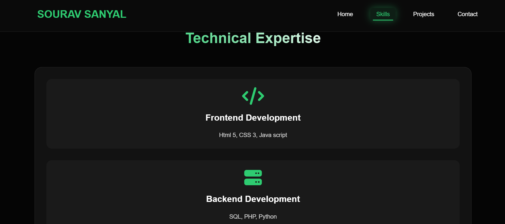

# Sourav Sanyal Portfolio

Personal portfolio website built with HTML, CSS, and JavaScript.

This project showcases my profile, technical skills, project link, and contact options in a responsive single-page layout.

## Author

Sourav Sanyal

## Features

- Responsive design for desktop, tablet, and mobile
- Hero section with profile photo and quick action buttons
- Skills section with Frontend, Backend, and MS Office tools
- Project section linked to GitHub repository
- Contact section with email and social links
- Download/View CV button in hero section

## Tech Stack

- HTML5
- CSS3
- JavaScript (vanilla)
- Font Awesome (icons)

## Current Project Structure

```text
Portfolio/
|- index.html
|- style.css
|- script.js
|- new fev.jpeg
|- SOURAV SANYAL CV.pdf
|- README.md
```

## Run Locally

```bash
git clone https://github.com/sourav444-tec/Portfolio.git
cd Portfolio
start index.html
```

You can also run with a live server extension in VS Code.

## Customize Quickly

- Update profile photo path in index.html
- Edit text/content sections in index.html
- Change colors, spacing, and responsive rules in style.css
- Adjust interactivity in script.js

## Screenshot



## Contact

- Email: sanyalsourav570@gmail.com
- GitHub: https://github.com/sourav444-tec
- LinkedIn: https://www.linkedin.com/in/sourav-sanyal-31b47b31b/

## License

This project is open for learning and personal customization.
