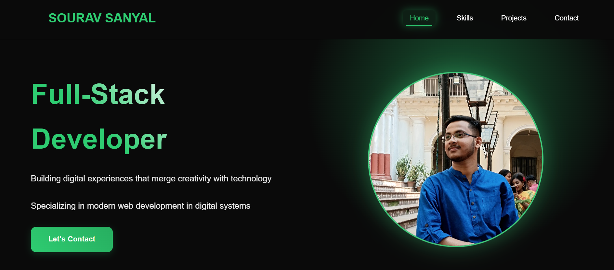
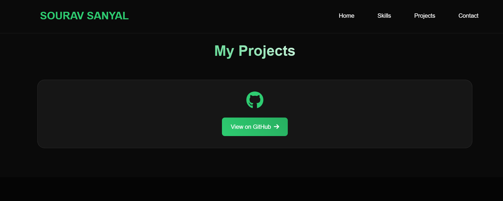
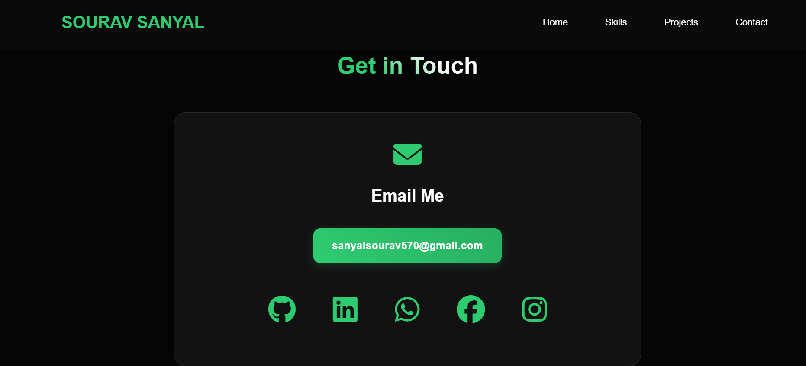

# Portfolio

This is my first portfolio
<br>
Author - Sourav Sanyal (COMPUTER APPLICATION)
<br>
Perfect! Let’s craft a professional, engaging **README.md** for your portfolio website. Since a README is the first impression on GitHub, it should explain what your project is, how to use it, and why it matters. Here’s a polished draft you can adapt:

---

# 🌐 Sourav Sanyal – Portfolio Website

A modern, responsive portfolio website showcasing my skills, projects, and contact information. Built to highlight my journey as a **Full-Stack Developer** and provide a central hub for my digital presence.

---

## 🚀 Features

- **Responsive Design** – Works seamlessly across devices
- **Dark Theme with Green Accents** – Sleek and modern UI
- **Navigation Sections** – Home, Skills, Projects, Contact
- **Hero Section** – Professional tagline and photo
- **Contact Button** – Easy way to connect with me

---

## 🛠️ Tech Stack

- **Frontend:** HTML5, CSS3, JavaScript
- **Design:** Modern UI principles, responsive layout
- **Deployment:** Can be hosted on GitHub Pages, Netlify, or Vercel

---

## 📂 Project Structure

```bash
portfolio-website/
│── index.html        # Main homepage
│── /assets           # Images, icons, and other static files
│── /css              # Stylesheets
│── /js               # JavaScript files
│── /projects         # Project showcase pages
│── README.md         # Documentation
```

---

## ⚡ Getting Started

### Prerequisites

- A modern browser (Chrome, Edge, Firefox)
- Basic knowledge of HTML/CSS/JS

### Run Locally

```bash
# Clone the repository
git clone https://github.com/sourav444-tec/Portfolio.git

# Navigate to project folder
cd portfolio-website

# Open in browser
start index.html   # Windows
open index.html    # macOS
```

---

## 📸 Screenshots






---

## 📬 Contact

👤 **Sourav Sanyal**

- Portfolio: [souravsanyal.netlify.app]
- Email: [sanyalsourav570@gmail.com]
- LinkedIn: [https://www.linkedin.com/in/sourav-sanyal-31b47b31b/overlay/about-this-profile/?lipi=urn%3Ali%3Apage%3Ad_flagship3_profile_view_base%3Br03BEac7RqefWlbK4erp1g%3D%3D]
- GitHub: [sourav444-tec]

---

## ⭐ Acknowledgements

- Inspired by modern portfolio designs
- Built with passion for creativity + technology

---

👉 Tip: Once you push this to GitHub, you can enable **GitHub Pages** to make your portfolio live directly from the repo.

---

Would you like me to also **add badges** (like GitHub stars, forks, or “Made with ❤️ in HTML/CSS/JS”) to make the README more eye-catching?
